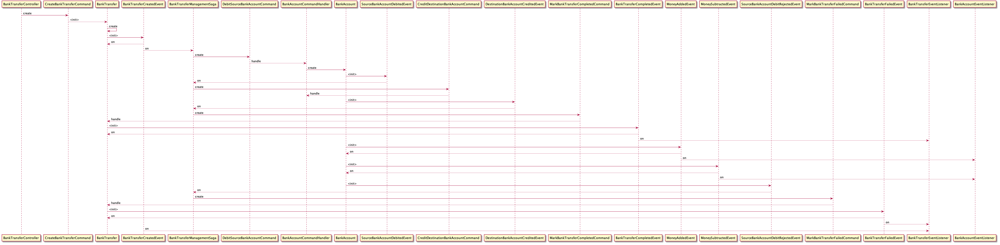

Axon MRI - Flow visualization tool
==================================

MRI helps you visualize flow of the code when using Axon Framework.

Upgrade
------------

1. Upgrade spoon-core version.
2. Fix bugs.

Installation
------------

	gradle jar

Usage
-----

1. Before executing this tool you need to have maven project.

To print the Axon flow:

    java -jar build/libs/org.mri-VERSION.jar -s (--source-maven-project-folder) MAVEN_PROJECT -m (--method-name) METHOD_NAME

    -s (--source-folder) SOURCE_FOLDERS : source folder(s) for the analyzed maven project
    -m (--method-name) METHOD_NAME      : method name (can be a regexp) to print axon flow for

Example
-------

Execute following from this project root directory. Don't use Lombok:

	$ git clone https://github.com/hananbing/AxonBank.git ../AxonBank
	$ git checkout no-lombok
	$ java -jar build/libs/org.mri-*.jar -s ../AxonBank -m createTransfers

Output:

```
	@startuml create-transfers-flow.png
  participant BankTransferController
  participant CreateBankTransferCommand
  participant BankTransfer
  participant BankTransferCreatedEvent
  participant BankTransferManagementSaga
  participant DebitSourceBankAccountCommand
  participant BankAccountCommandHandler
  participant BankAccount
  participant SourceBankAccountDebitedEvent
  participant CreditDestinationBankAccountCommand
  participant DestinationBankAccountCreditedEvent
  participant MarkBankTransferCompletedCommand
  participant BankTransferCompletedEvent
  participant MoneyAddedEvent
  participant MoneySubtractedEvent
  participant SourceBankAccountDebitRejectedEvent
  participant MarkBankTransferFailedCommand
  participant BankTransferFailedEvent

  BankTransferController -> CreateBankTransferCommand: create
  CreateBankTransferCommand --> BankTransfer: <init>
  BankTransfer -> BankTransfer: create
  BankTransfer -> BankTransferCreatedEvent: <init>
  BankTransferCreatedEvent --> BankTransfer: on
  BankTransferCreatedEvent --> BankTransferManagementSaga: on
  BankTransferManagementSaga -> DebitSourceBankAccountCommand: create
  DebitSourceBankAccountCommand --> BankAccountCommandHandler: handle
  BankAccountCommandHandler -> BankAccount: create
  BankAccount -> SourceBankAccountDebitedEvent: <init>
  SourceBankAccountDebitedEvent --> BankTransferManagementSaga: on
  BankTransferManagementSaga -> CreditDestinationBankAccountCommand: create
  CreditDestinationBankAccountCommand --> BankAccountCommandHandler: handle
  BankAccount -> DestinationBankAccountCreditedEvent: <init>
  DestinationBankAccountCreditedEvent --> BankTransferManagementSaga: on
  BankTransferManagementSaga -> MarkBankTransferCompletedCommand: create
  MarkBankTransferCompletedCommand --> BankTransfer: handle
  BankTransfer -> BankTransferCompletedEvent: <init>
  BankTransferCompletedEvent --> BankTransfer: on
  BankTransferCompletedEvent --> BankTransferEventListener: on
  BankAccount -> MoneyAddedEvent: <init>
  MoneyAddedEvent --> BankAccount: on
  MoneyAddedEvent --> BankAccountEventListener: on
  BankAccount -> MoneySubtractedEvent: <init>
  MoneySubtractedEvent --> BankAccount: on
  MoneySubtractedEvent --> BankAccountEventListener: on
  BankAccount -> SourceBankAccountDebitRejectedEvent: <init>
  SourceBankAccountDebitRejectedEvent --> BankTransferManagementSaga: on
  BankTransferManagementSaga -> MarkBankTransferFailedCommand: create
  MarkBankTransferFailedCommand --> BankTransfer: handle
  BankTransfer -> BankTransferFailedEvent: <init>
  BankTransferFailedEvent --> BankTransfer: on
  BankTransferFailedEvent --> BankTransferEventListener: on
  BankTransferCreatedEvent --> BankTransferEventListener: on
  @enduml
```


Image output:
-------

Run (requires download [plantuml](https://plantuml.com/zh/download) jar as shell command):

	$ java -DPLANTUML_LIMIT_SIZE=8192 -jar plantuml.1.2020.16.jar -charset UTF-8 ./mri/ddd.puml



Contributors
-------

@pbadenski
@jweissman
@hananbing